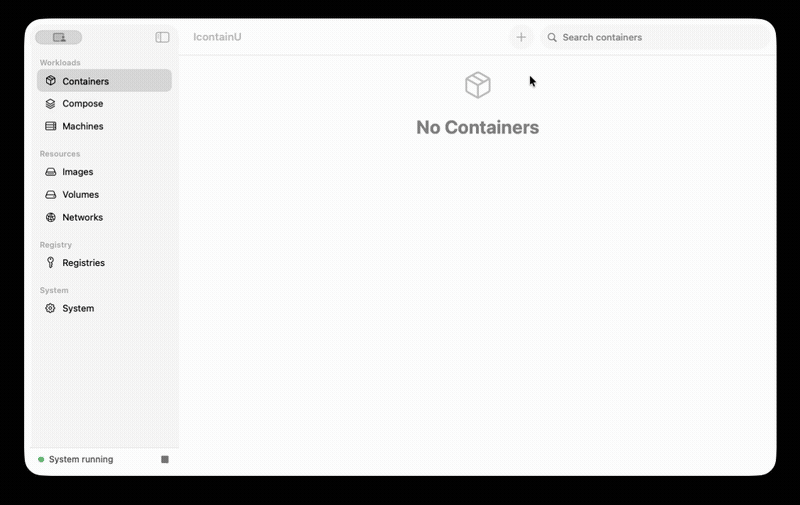
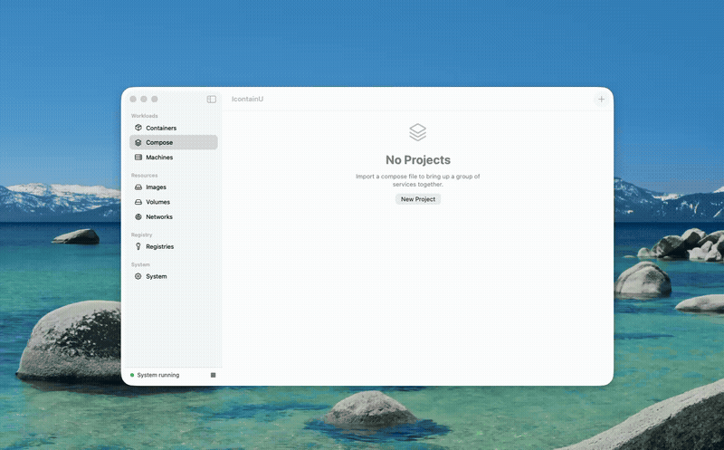
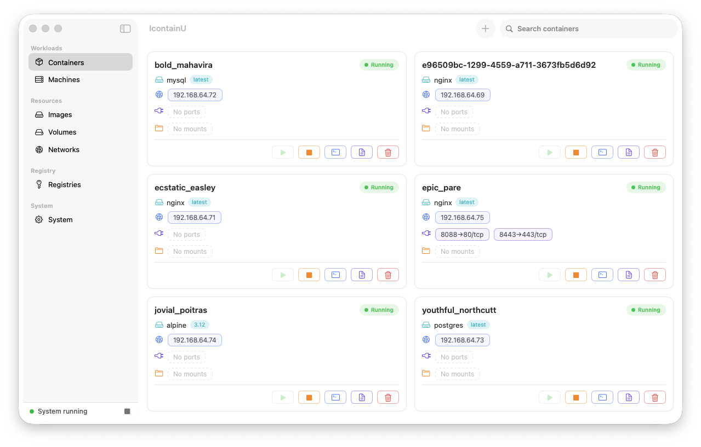
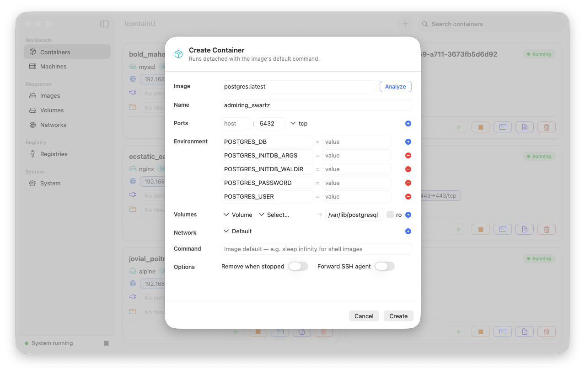
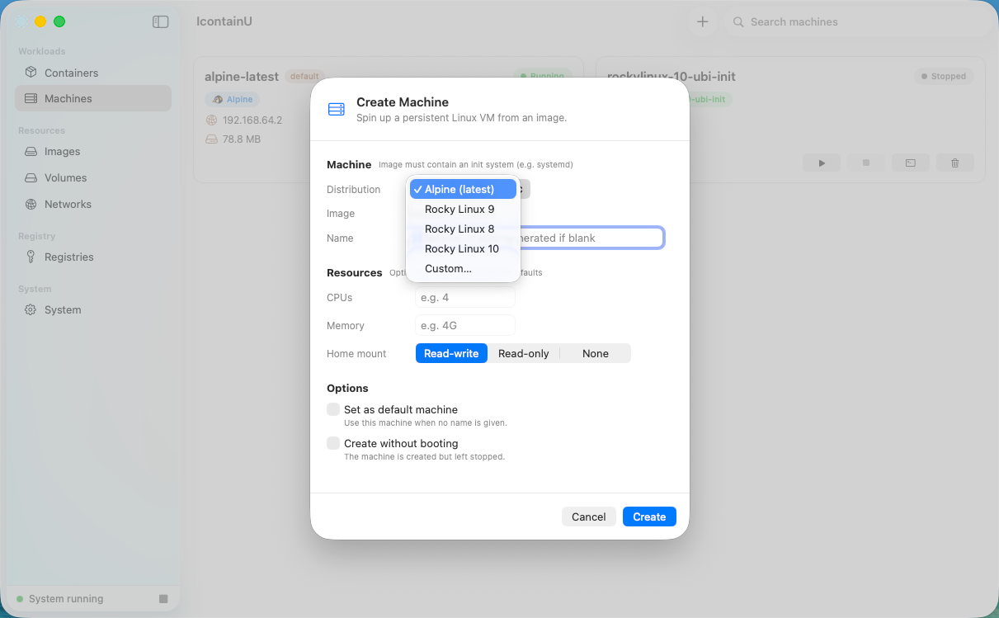
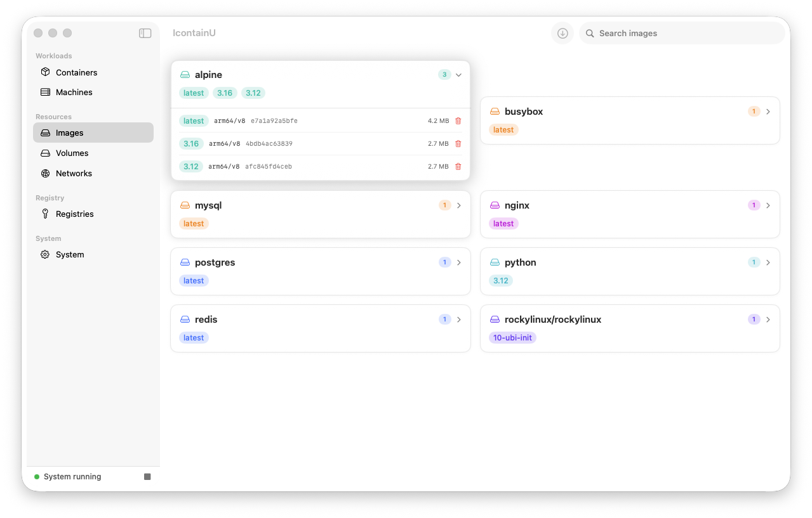
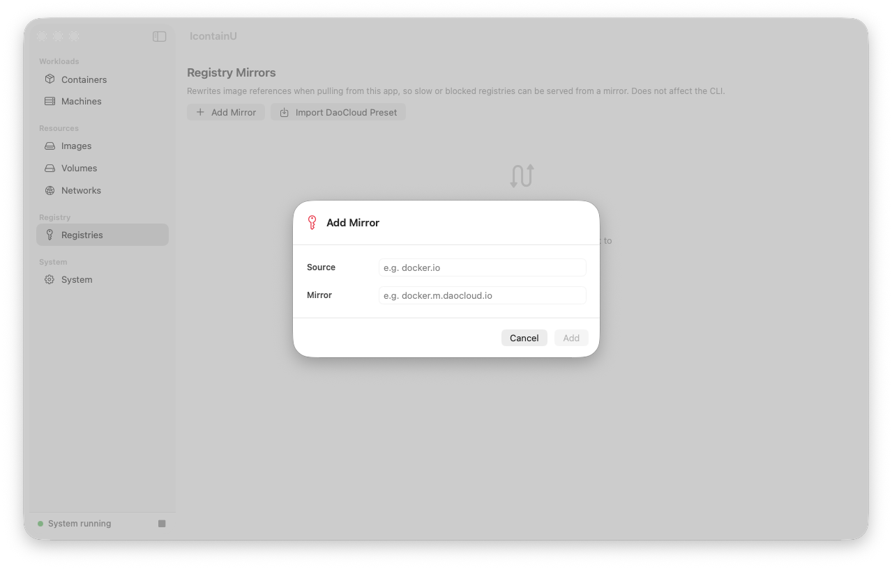
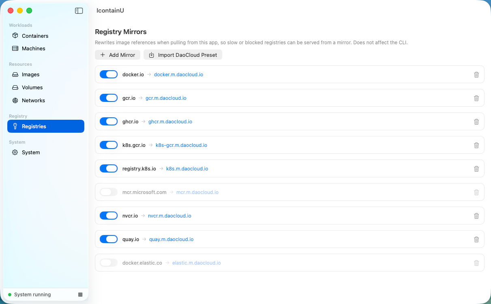

<div align="center">

# IcontainU

**A native macOS GUI for Apple's [`container`](https://github.com/apple/container).**

*`I`* — Apple's lowercase‑i lineage (iOS, iPhone) · *`contain`* — container · *`U`* — UI

Built with SwiftUI. No Electron, no daemon of its own — it just drives the `container` you already have.

English | [中文](README_zh.md)

</div>

---

## Highlights

Two things make IcontainU worth your dock:

| ⚡ Smart Create | 🧩 One‑click Compose |
| --- | --- |
|  |  |
| **Drop in an image, the form fills itself.** Ports, mounts, and the env vars the entrypoint *actually needs* (like `MYSQL_ROOT_PASSWORD`) are read from the image and pre‑filled. No more copying `docker run` snippets. | **Bring a whole stack up in one click.** Import a `compose.yaml` and Up the project in dependency order, with `healthcheck` gating. Projects persist across `down` and restarts — and it works around Apple `container`'s broken container‑to‑container DNS so service names just resolve. |

## More features

- **🐧 Machines that just work** — presets pointing at official *init‑ready* images (Alpine, Rocky UBI‑init), so machines actually boot. CPU, memory, and home‑mount are all settable.
- **📦 Smart image pull** — pulls only your host architecture, and is registry‑mirror aware with a one‑click **DaoCloud preset** (9 registries, individually toggleable) that leaves no trace on local images.
- **🃏 Everything on a card** — Start / Stop / Shell / Logs / Delete per container, plus a live **stats** tab and streaming logs.
- **✨ Friction removers** — tap to copy an IP or `ip:port`, tap a mount to open it in Finder, local‑image autocomplete, and Docker‑style auto‑naming.
- **🚀 Frictionless setup** — first launch auto‑installs the kernel and monitors `container` health for you.

## Screenshots

| Containers | Create a container |
| --- | --- |
|  |  |

| Create a machine | Images |
| --- | --- |
|  |  |

| Registry mirrors | DaoCloud one-click preset |
| --- | --- |
|  |  |

## Requirements

- **Apple silicon** Mac (M‑series), **macOS 26** or newer
- Apple [`container`](https://github.com/apple/container/releases) ≥ 1.0.0 installed

Start the system once from the CLI so it installs the kernels (faster than the in‑app download):

```bash
container system start
container system status   # should report: running
```

Without a running `container` system the app still opens, but the sidebar stays empty.

## Download & install

Download `IcontainU-v0.2.0.zip` from [Releases](../../releases), unzip, and move `IcontainU.app` to Applications.

Not notarized — on first launch, right‑click → Open, or run:

```bash
xattr -d com.apple.quarantine /Applications/IcontainU.app
```

## Build from source

Requires the Swift 6.2 toolchain (Xcode 26).

```bash
swift build && swift run IcontainU
# package a signed .app:
./scripts/package-app.sh
```

## Status & known limitations

**0.2.0** — early, but useful day to day.

- `Shell` opens Terminal.app — no embedded terminal yet.
- System configuration is **view‑only** in the app; edit it via the CLI.
- Menu bar support is under development.

## Compose reference

IcontainU supports a **practical subset** of the Compose spec. Anything unsupported is surfaced as a warning banner at import — **never silently dropped**.

<b>Supported fields &amp; what's not</b>

| Field | Notes |
| --- | --- |
| `image` | — |
| `command` | string **or** array form |
| `ports` | numeric and `host:container/proto` |
| `environment` | list `["K=V"]` **and** map `{K: V}` |
| `volumes` | named (`vol:/data`) and bind (`/host:/data[:ro]`, incl. relative `./`) |
| `networks` | per‑service and top‑level |
| `depends_on` | start order **and** `condition: service_healthy` |
| `healthcheck` | `test`, `interval`, `timeout`, `retries`, `start_period` |
| `container_name`, `user` | — |
| top‑level `networks:` / `volumes:` | — |

Plus `${VAR}` / `.env` interpolation at parse time.

**Not supported:**

| Field | Notes |
| --- | --- |
| `build:` | — |
| `restart:` | — |
| `deploy.replicas` / scale | — |
| `env_file` | — |
| `profiles` | — |
| `secrets` | — |
| `configs` | — |
| `extends` | — |
| YAML anchors | — |
| advanced `driver_opts` | — |

<b>Project isolation &amp; multi‑network</b>

- **Every project is namespaced.** Containers, volumes and networks are prefixed with the project name, so two projects that each declare a `db` service run side by side. Pinning the **same** `container_name:` in two projects fails loudly instead of hijacking.
- **Multi‑network is fully supported.** A service on several networks resolves each peer on a network the two containers actually share.

<b>Healthcheck gating</b> — how <code>service_healthy</code> is honored

Apple `container` 1.0.0 has no native healthcheck, so IcontainU runs the probe via `container exec` **during Up** to gate `depends_on: { condition: service_healthy }`. There is no always‑on healthy/unhealthy badge.

- If a gated dependency never becomes healthy, Up fails but the dependency is left running so its logs explain why — fix the compose file and re‑Up.
- A `service_healthy` dependency with **no** healthcheck warns and is treated as start‑order only.

<b>Runtime constraints</b> — Apple <code>container</code> on macOS 26 (not IcontainU bugs)

- **Container‑to‑container DNS is broken on macOS 26 — IcontainU works around it** by injecting `<service> → real IP` into each container's `/etc/hosts` after Up.
- **Database data dirs on bind mounts — the chown problem and how to fix it.**

  On macOS, the bind-mount root is owned by the host user and refuses `chown`. Images that `chown` their data directory at startup fail with "Operation not permitted" when the data directory *is* the mount-point root:

  ```
  # MySQL / MariaDB
  chown: changing ownership of '/var/lib/mysql/': Operation not permitted

  # PostgreSQL ≤17
  chmod: changing permissions of '/var/lib/postgresql/data': Operation not permitted
  chown: changing ownership of '/var/lib/postgresql/data': Operation not permitted
  ```

  **Affected versions:**
  - **PostgreSQL 17 and below** — `PGDATA` defaults to `/var/lib/postgresql/data`, which is the mount-point root → fails.
  - **PostgreSQL 18+** — `PGDATA` defaults to a subdirectory (`/var/lib/postgresql/18/docker`) → no issue, works out of the box.
  - **MySQL / MariaDB** — all versions are affected.

  **Fix:** point the data directory at a *subdirectory* of the mount instead. The image-specific setting that controls this differs per image:

  | Image | Fix | Example compose snippet |
  | --- | --- | --- |
  | PostgreSQL ≤17 | Set `PGDATA` to a subdirectory | `environment: PGDATA: /var/lib/postgresql/data/pgdata` |
  | MySQL / MariaDB | Pass `--datadir` pointing to a subdirectory | `command: ["--datadir", "/var/lib/mysql/data"]` |

  Ready-to-use templates with the fix pre-applied are in [`samples/`](samples/):
  - [`template-postgres-17.yaml`](samples/template-postgres-17.yaml) — PostgreSQL 17 with bind-mounted data dir
  - [`template-mysql.yaml`](samples/template-mysql.yaml) — MySQL 8 with bind-mounted data dir

  Import via **Compose → New Project**, edit the password and host path, then Up.
- **Non‑root images need `user: "0"` on a named volume**, otherwise they can't write their data dir.

## License & acknowledgements

Licensed under the Apache License 2.0 — see [LICENSE](LICENSE). Built on Apple's `container` and `containerization`; see [NOTICE](NOTICE) for attribution.

Developed with the assistance of vibe coding (AI-assisted development).
