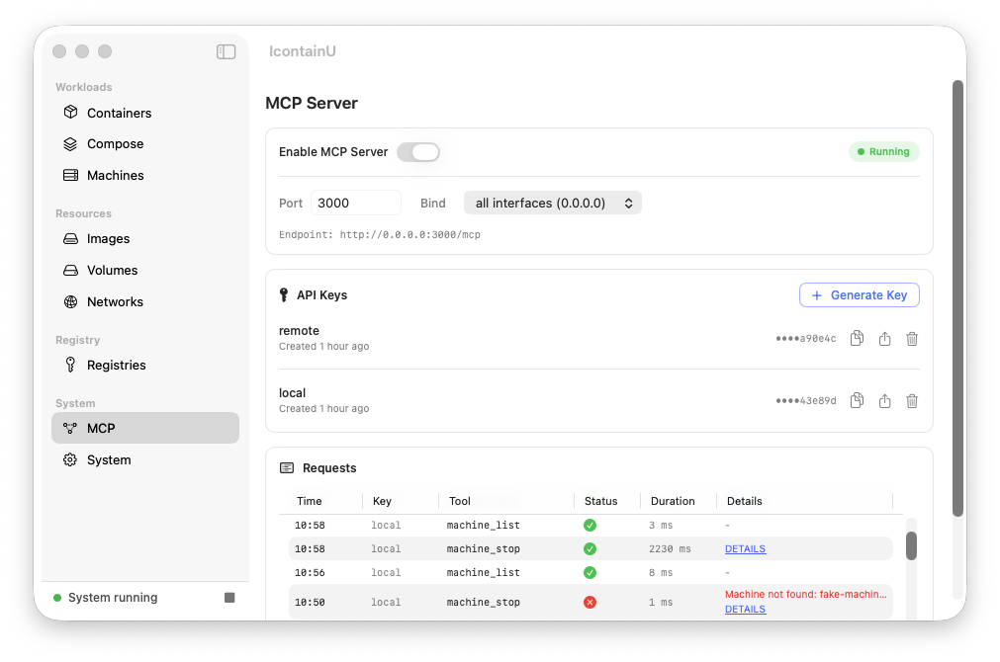

<div align="center">

# IcontainU

**Apple [`container`](https://github.com/apple/container) 的原生 macOS 图形界面。**

*`I`* — Apple 小写 i 体系 (iOS, iPhone) · *`contain`* — container · *`U`* — UI

基于 SwiftUI 构建。没有 Electron，没有额外守护进程 — 它只驱动你已有的 `container` 系统。

[English](README.md) | 中文

</div>

---

## 亮点

两个功能，值得你把它放进 Dock：

| ⚡ 智能创建 | 🧩 一键 Compose |
| --- | --- |
|  |  |
| **放入镜像，表单自动填满。** 端口、挂载，以及入口脚本*真正需要*的环境变量（如 `MYSQL_ROOT_PASSWORD`）都从镜像中读出并预填。不必再抄 `docker run` 片段。 | **一键拉起整个技术栈。** 导入 `compose.yaml`，按依赖顺序 Up 整个项目，含 `healthcheck` 门控。项目落盘持久化，`down` 或重启后仍在 —— 还绕过了 Apple `container` 失效的容器间 DNS，让服务名开箱即用。 |

## 更多功能

- **🐧 开箱即用的虚拟机** —— 内置指向官方 *init 就绪镜像*的预设（Alpine、Rocky UBI‑init），机器真能启动。CPU / 内存 / home 挂载均可设置。
- **📦 智能镜像拉取** —— 只拉当前主机架构，且支持镜像加速，一键 **DaoCloud 预设**（9 个仓库、可单独开关），且不在本地镜像上留痕。
- **🃏 卡片式管理** —— 每个容器卡片都有 启动 / 停止 / Shell / 日志 / 删除，外加实时 **Stats** 与流式日志。
- **✨ 消除摩擦** —— 点击复制 IP 或 `ip:port`，点击挂载在 Finder 打开，本地镜像自动补全，Docker 风格自动命名。
- **🚀 无摩擦初始化** —— 首次启动自动安装 kernel，并持续监控 `container` 健康状态。
- **🤖 MCP server** —— 内置 [Model Context Protocol](https://modelcontextprotocol.io) server，暴露 25 个工具供 Claude Code、OpenCode 等 MCP 客户端通过 HTTP 远程操控容器、镜像、虚拟机、卷、网络和 Compose 项目（Bearer API Key 鉴权）。详见 [docs/mcp_server.md](docs/mcp_server.md)。

## 截图

| 容器 | 创建容器 |
| --- | --- |
|  |  |

| 创建虚拟机 | 镜像 |
| --- | --- |
|  |  |

| 镜像加速 | 内置 MCP server |
| --- | --- |
|  |  |


## 环境要求

- **Apple silicon** Mac（M 系列），**macOS 26** 或更新版本
- 已安装 Apple [`container`](https://github.com/apple/container/releases) ≥ 1.0.0

建议首次从命令行启动一次，让它安装好 kernel（比应用内下载更快）：

```bash
container system start
container system status   # 应报告: running
```

如果 `container` 系统未运行，应用仍可打开，但侧边栏为空。

## 下载与安装

从 [Releases](../../releases) 下载 `IcontainU-v0.2.0.zip`，解压后将 `IcontainU.app` 移到 Applications。

未公证 —— 首次启动请右键 → 打开，或运行：

```bash
xattr -d com.apple.quarantine /Applications/IcontainU.app
```

## 从源码构建

需要 Swift 6.2 工具链（Xcode 26）。

```bash
swift build && swift run IcontainU
# 打包签名后的 .app：
./scripts/package-app.sh
```

## 状态与已知限制

**0.2.0** —— 早期版本，但日常使用已足够。

- `Shell` 打开系统 Terminal.app —— 尚未内嵌终端。
- 系统配置在应用中**只读**；请通过 CLI 编辑。
- 菜单栏功能正在开发中。

## Compose 参考

IcontainU 支持 Compose 规范的一个**实用子集**。任何不支持的内容都会在导入时以警告横幅提示 —— **绝不静默丢弃**。

<b>支持的字段与不支持项</b>

| 字段 | 说明 |
| --- | --- |
| `image` | — |
| `command` | 字符串**或**数组 |
| `ports` | 数字与 `host:container/proto` |
| `environment` | list `["K=V"]` **与** map `{K: V}` |
| `volumes` | 命名卷（`vol:/data`）与 bind（`/host:/data[:ro]`，含相对路径 `./`） |
| `networks` | 服务级与顶层 |
| `depends_on` | 启动顺序**与** `condition: service_healthy` |
| `healthcheck` | `test`、`interval`、`timeout`、`retries`、`start_period` |
| `container_name`、`user` | — |
| 顶层 `networks:` / `volumes:` | — |

以及解析时的 `${VAR}` / `.env` 插值。

**不支持：** `build:` · `restart:` · `deploy.replicas` / scale · `env_file` · `profiles` · `secrets` · `configs` · `extends` · YAML anchor · 高级 `driver_opts`。需要它们的栈（如带 TLS 的 Elastic 全家桶）可解析和预览，但无法原样 Up。

<b>项目隔离与多网络</b>

- **每个项目都有命名空间。** 容器、卷、网络都以项目名为前缀，因此两个都声明 `db` 服务的项目可并存运行。在两个项目里钉相同的 `container_name:` 会明确报错，而非互相劫持。
- **完整支持多网络。** 处于多个网络的服务，会在双方实际共享的网络上解析到正确的对端 IP。

<b>健康检查门控</b> —— <code>service_healthy</code> 如何生效

Apple `container` 1.0.0 没有原生健康检查，因此 IcontainU 在 **Up 期间**通过 `container exec` 执行探针，用于门控 `depends_on: { condition: service_healthy }`。没有常驻的 healthy/unhealthy 角标。

- 若被门控的依赖始终不健康，Up 失败，但该依赖容器会保留运行以便查看日志 —— 修正 compose 文件后重新 Up。
- 声明了 `service_healthy` 但**没有** healthcheck 的依赖，会以警告提示并退化为仅启动顺序。

<b>运行时限制</b> —— Apple <code>container</code> 在 macOS 26 上的行为（非 IcontainU 的 bug）

- **容器间 DNS 在 macOS 26 上是坏的 —— IcontainU 已绕过**：Up 后把 `<服务名 → 真实 IP>` 注入每个容器的 `/etc/hosts`。
- **数据库数据目录与 bind 挂载 — chown 问题及修复。**

  macOS 上 bind 挂载的根目录归宿主用户所有，不允许 `chown`。启动时需要对数据目录执行 `chown` 的镜像在数据目录恰好是挂载点根目录时会报错：

  ```
  # MySQL / MariaDB
  chown: changing ownership of '/var/lib/mysql/': Operation not permitted

  # PostgreSQL ≤17
  chmod: changing permissions of '/var/lib/postgresql/data': Operation not permitted
  chown: changing ownership of '/var/lib/postgresql/data': Operation not permitted
  ```

  **受影响版本：**
  - **PostgreSQL 17 及以下** — `PGDATA` 默认为 `/var/lib/postgresql/data`，即挂载点根目录 → 失败。
  - **PostgreSQL 18+** — `PGDATA` 默认指向子目录（`/var/lib/postgresql/18/docker`）→ 无此问题，开箱即用。
  - **MySQL / MariaDB** — 所有版本均受影响。

  **修复：** 将数据目录指向挂载点的**子目录**。不同镜像的控制方式不同：

  | 镜像 | 修复方式 | Compose 片段示例 |
  | --- | --- | --- |
  | PostgreSQL ≤17 | 设置 `PGDATA` 指向子目录 | `environment: PGDATA: /var/lib/postgresql/data/pgdata` |
  | MySQL / MariaDB | 传 `--datadir` 指向子目录 | `command: ["--datadir", "/var/lib/mysql/data"]` |

  已内置修复的模板在 [`samples/`](samples/) 目录：
  - [`template-postgres-17.yaml`](samples/template-postgres-17.yaml) — PostgreSQL 17，bind 挂载数据目录
  - [`template-mysql.yaml`](samples/template-mysql.yaml) — MySQL 8，bind 挂载数据目录

  通过 **Compose → New Project** 导入，修改密码和宿主机路径后 Up 即可。
- **非 root 镜像在命名卷上需设 `user: "0"`**，否则写不了自己的数据目录。

## Samples（示例项目）

[`samples/`](samples/) 目录随 IcontainU 附带的 Compose 示例模板，可在 **Compose → New Project** 里导入后直接 Up。每一个都已在 IcontainU 上验证可运行。

| 栈 | 服务 | 说明 |
|---|------|------|
| [postgresql-pgadmin](samples/postgresql-pgadmin/) | PostgreSQL + pgAdmin | `${VAR}` 占位模板——导入前编辑密码 |
| [gitea-postgres](samples/gitea-postgres/) | Gitea + PostgreSQL | 命名卷，`restart: always` |
| [nextcloud-postgres](samples/nextcloud-postgres/) | Nextcloud + PostgreSQL | |
| [nextcloud-redis-mariadb](samples/nextcloud-redis-mariadb/) | Nextcloud + Redis + MariaDB | **多网络**示例（独立的 dbnet / redisnet） |
| [wordpress-mysql](samples/wordpress-mysql/) | WordPress + MariaDB | |
| [elasticsearch-logstash-kibana](samples/elasticsearch-logstash-kibana/) | ELK（ES 8 + Logstash + Kibana） | 完整 healthcheck + `depends_on: condition: service_healthy` |
| [prometheus-grafana](samples/prometheus-grafana/) | Prometheus + Grafana | `user: "0"` 用于命名卷写；配置用 bind mount |
| [postgres-healthcheck](samples/postgres-healthcheck/) | PostgreSQL + Alpine | 最小 healthcheck / `service_healthy` 示例 |
| [kafka-cluster-kraft](samples/kafka-cluster-kraft/) | Kafka 4.3.1 KRaft（3 controller + 3 broker） | 主机名 advertised listeners；depends_on 启动 |
| [redis-cluster](samples/redis-cluster/) | Redis 7 集群 | 3主3从，自动故障转移；`cluster-announce-hostname` + `/etc/hosts` 绕过 DNS |
| [redis-cluster-envoy-proxy](samples/redis-cluster-envoy-proxy/) | Redis 集群 + Envoy 代理 | 在 `host:6379` 的 slot-aware Envoy 代理——纯 `redis-cli` 即可，无需 `-c` |
| [`template-mysql.yaml`](samples/template-mysql.yaml) | MySQL 8（单服务） | 独立模板；数据目录 bind mount + `--datadir` 子目录（macOS chown 修复） |
| [`template-postgres-17.yaml`](samples/template-postgres-17.yaml) | PostgreSQL 17（单服务） | 独立模板；`PGDATA` 子目录 bind mount（macOS chown 修复） |

> **macOS bind mount 注意：**部分示例使用 bind 挂载的数据目录。macOS 上挂载根目录归宿主用户所有、不可 `chown`。需要在数据目录 `chown` 的镜像（MySQL、PostgreSQL ≤ 17）被指向**子目录**——模板已处理此问题。详见 [Compose 参考](#compose-参考)。

## MCP server

IcontainU 内置的 [Model Context Protocol](https://modelcontextprotocol.io) server，让 AI 客户端（Claude Code、OpenCode 等）通过 MCP 协议远程操作容器、镜像、虚拟机、存储卷、网络和 Compose 项目——适合从 Claude Code 发起的「拉起这个栈并确认健康」这类工作流。

- **传输**：MCP over Streamable HTTP，端点 `/mcp`（swift-nio，默认端口 `3000`）。
- **鉴权**：Bearer API Key，在 App 内 **MCP** 面板生成管理。常量时间比较，无 Key 无访问。
- **绑定**：默认 `127.0.0.1`（仅本机）；在面板里切到 `0.0.0.0` 可从局域网访问。

**25 个工具**，分 6 个资源组：

| 资源组 | 工具 |
| --- | --- |
| Container（容器） | `list`, `create`, `start`, `stop`, `delete`, `exec`, `logs`, `inspect` |
| Image（镜像） | `list`, `pull`, `delete` |
| Machine（虚拟机） | `list`, `boot`, `stop`, `delete` |
| Volume（存储卷） | `list`, `create`, `delete` |
| Network（网络） | `list`, `create`, `delete` |
| Compose | `list`, `up`, `down`, `status` |

完整的 tool schema、参数与示例：[docs/mcp_server.md](docs/mcp_server.md)。

客户端配置（`.mcp.json`，配置里 server 名叫 `containers`）：

```json
{
  "mcpServers": {
    "containers": {
      "type": "streamable-http",
      "url": "http://127.0.0.1:3000/mcp",
      "headers": {
        "Authorization": "Bearer <your-api-key>"
      }
    }
  }
}
```

**主要限制**：
- 不支持 host bind mount（宿主机路径挂载）——只允许命名卷。
- Compose 不解析相对路径 / `.env`。
- `container_logs` 默认 tail 200 行，受 256 KB 上限约束。
- 请求体 1 MB 上限。
- 无 `machine_create`（只在 App UI 里做）。
- 详细限制见 [docs/mcp_server.md](docs/mcp_server.md)。

## 许可证与致谢

基于 Apache License 2.0 开源 —— 见 [LICENSE](LICENSE)。基于 Apple 的 `container` 和 `containerization` 构建；见 [NOTICE](NOTICE) 的归属说明。

在 vibe coding（AI 辅助开发）的协助下完成开发。
